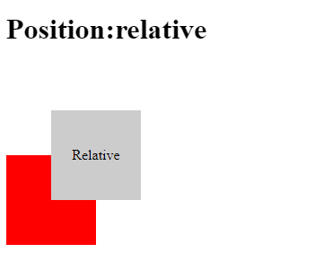
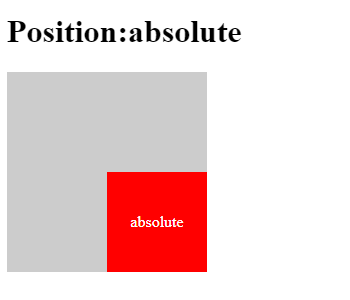

## 前言

`position`這個屬性在 CSS 裡面也算是前三種必學的屬性。

我將會帶大家將幾個比較基礎及在實作上或業界上比較常用到的值先有個觀念，方便大家有個基本且正確的觀念。

`position`基本上僅需填寫一個值，撰寫方式如同下面這樣。

```css title='style.css'
div {
  position:relative
}

```

:::tip
#### `position`目前比較常用到值有以下:
- static (靜態定位)
- relative (相對定位)
- absolute (絕對定位)
- fixed (固定定位)
- sticky (黏貼定位)
:::

---

## Position 的用途
> Position 主要用途是用來「可以用定位方式」，去控制版面配置，如果對A物件加了position，就能改變A物件所參考的空間對象，去改變A物件的位置。接下來讓我們看看範例吧!!

## Position-static(靜態定位)
> `static` 是所有定位中最少用到的，除非有特殊狀況，不然會用到，多數的物件預設都是這種定位。以正常排序來說，區塊元素就是以由上至下排序，行內元素就是由左至右。

## Position-relative(相對定位)
> `relative`移動方式是以參考物件原本位置，相其做定位。

這樣講大家可能不太好理解，我們可以看下面示範。

```html title='index.html'
<!DOCTYPE html>
<head>
  <link href="style.css" rel="stylesheet" type="text/css" media="all" />
</head>
<body>
  <h1>
    Position:relative
  </h1>
  <div class="grey_box">Relative</div>
  <div class="red_box"></div>
</body>

```

```css title='style.css'
.grey_box {
  width: 100px;
  height: 100px;
  background-color: #ccc;
  display: flex;
  justify-content: center;
  align-items: center;
  position: relative;
  top: 50px;
  left: 50px;
}
.red_box {
  width: 100px;
  height: 100px;
  background-color: #f00;
}
```


顯示結果會發現只有grey_box以自身位置向右下向下移動各50px位置。


---

## Position-absolute(絕對定位)
> `absolute`移動方式是以自身位置**最近的**而且具有**定位設定**的**父層元素**相其做定位，但是沒有任何一個父層具有定位設定，最後物件會以視窗參考位置。

:::tip
#### 而父層只要有以下四種定位類型，就可被絕對定位做為參考位置。

- relative
- absolute
- fixed
- sticky
:::

:::note 備註
當物件設定了 absolute 之後，將會自己獨立一層，不會與其它物件有任何關連，所以可以利用 absolute 來做到物件堆疊的視覺效果喔!
:::

這一種定位是比較特殊，也相對不太好理解，我們可以看下面示範。

```html title='index.html'
<!DOCTYPE html>
<head>
  <link href="style.css" rel="stylesheet" type="text/css" media="all" />
</head>
<body>
  <h1>
    Position:absolute
  </h1>
  <div class="grey_box"><div class="red_box">absolute</div></div>
</body>

```

```css title='style.css'
.grey_box {
  width: 200px;
  height: 200px;
  background-color: #ccc;
  position: relative;
}
.red_box {
  width: 100px;
  height: 100px;
  background-color: #f00;
  color: #fff;
  position: absolute;
  top: 100px;
  left: 100px;
  display: flex;
  justify-content: center;
  align-items: center;
}
```



顯示結果會發現原本應該兩個區塊是併在一起(紅色方塊會在左上角)，但是因為我把它絕對定位了，並且她的父層也有做定位設定，有滿三個條件，所以它的位置會變到右下角了~~


---


