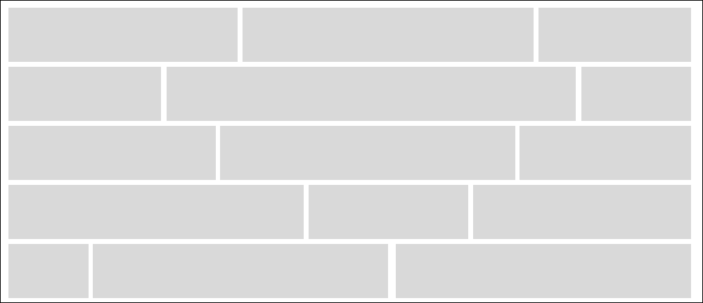

> ## 前言

在我們使用過很多標籤之後，會發現有些元素可以自動折行，有些元素會緊鄰隔壁黏死死的。

這一些小知識，寫網頁新手必學的小東西。

所以讓我們來了解一下行內元素及區塊元素的小知識，並記錄一下，順便也能了解一些元素之間的小禁忌。

> ## 行內(inline)元素
>
> 看到英文(inline)翻譯顧名思義，就是**_在一條線上_**所以是併在一起。

---

#### 行內元素會有以下特點:

- 和其他元素都在一行上，相臨的行内元素会排列在同一行，直到一行排不下，才會換行，其寬度隨元素的内容而變化。
- 設置寬高無效，只能由内容撑起来，即行内元素設置 width，height 屬性無效。
- 設置上下 margin、padding 无效，左右 padding 、margin 有效。
- 水平方向的 padding-left 、padding-right、margin-left、margin-right 都會產生效果，但上下方向的 padding-top、padding-bottom、margin-top 、
  margin-bottom 不會產生邊距效果。

#### 行內元素圖示

---

> ## 區塊(block)元素
>
> 看到英文(block)翻譯顧名思義，就是**_一區一區_**所以是分開的。

#### 區塊(block)元素會有以下特點:

- 區塊(block)元素都會另起一行。
- 高度，行高以及頂和底邊距都可控制。
- 默認情况下，其寬度自動填满其父元素寬度，即寬度為100%。
- 可以設置寬(width)高(height)。

#### 區塊(block)元素圖示

:::note 備註
新手菜鳥，還另請大家多多指教!!!
:::
