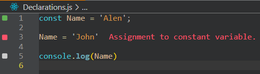

## 前言
`常數(Constant)`、`變數(Variable)`在JavaScript語言中扮演了重要的資料(值)存放角色。

在ES6標準之前，只有定義變數(var)沒有定義常數的方式，現在這兩者有不同的定義關鍵字與方式。

你可以把這兩者想成不同的盒子，想像完之後就讓我們一起去了解這之間的差異吧!!!

## 常數(Constant)
>裝入東西(值)之後就上鎖的盒子，之後不可以再更動裡面的值

### 常數宣告方式
```
const 常數名稱 = 值
```


:::tip

### 常數特性

- 裡面的值不可被更動


- 不可重複被宣告


:::

## 變數(Variable)
>暫時存放東西(值)的盒子，盒子是打開的，可以更動裡面的值

### 變數宣告方式
```
let 常數名稱 = 值
var 常數名稱 = 值
```


:::tip

### 變數特性 

- 裡面的值可被更動


- 不可重複被宣告


:::


